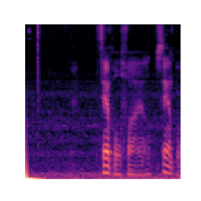

# Baby Noise Detection

This project is an attempt to distinguish between baby noises and other sounds. It is a continuation of the "baby-waking-up" project (https://github.com/MrRichard/baby-waking-up-db). The main question we are trying to answer is "can we determine what is baby noise and what is other noise?".

Given the abundance of baby crying noises, the approach taken here is to compare a known baby cry noise to new noises to determine if the record should be classified as a baby noise or not. 

The project is currently incomplete. The method used involves recording a sound sample, performing a Fast Fourier Transform on the wav file, and rendering the spectrum as an image. The image for the baby cry is then loaded as a 2D matrix and compared to another noise spectrum matrix using a Pearson Correlation Coefficient. The range of differences could potentially allow us to classify sounds as "baby vs not-baby" noises. 

Below is an example of a spectrum image generated from a sound sample.

## Files in the Project

- `compare_spectrums.py`: This file contains the functions to convert an image to a matrix and calculate the correlation between two matrices. The filenames must be renamed as `spectrum1.png` and `spectrum2.png` for this script to work.
- `main.py`: This is the main file that calls the functions to record the sound, create the spectrum, plot the image, and save the image. This is the recording program.

